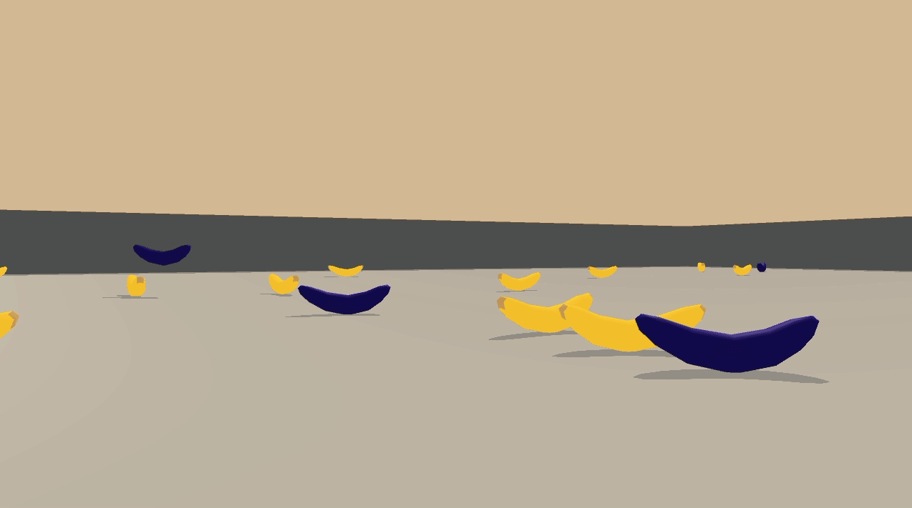

## Introduction
This project uses a Deep Q Network (DQN) to train an agent to navigate a 3D environment, specifically a variant of the [Banana Collector](https://github.com/Unity-Technologies/ml-agents/blob/master/docs/Learning-Environment-Examples.md#banana-collector) environment.  This project is being done as part of the [Udacity Deep Reinforcement Learning Nanodegree](https://www.udacity.com/course/deep-reinforcement-learning-nanodegree--nd893)..


## Environment
This environment is a simplified version of the [ML Agents](https://github.com/Unity-Technologies/ml-agents/blob/master/docs/Learning-Environment-Examples.md#banana-collector) example one.  It has a single agent, a smaller state space and a discrete action space.  The environment is a open 3D space that the agent will need to navigate.

#### Goal
The goal is to collect as many yellow bananas as possible while avoiding blue ones.
The task is episodic, and in order to solve the environment, the agent must get an average score of +13 over 100 consecutive episodes.

#### States
The state space has 37 dimensions and contains the agent's velocity, along with ray-based perception of objects around the agent's forward direction. Given this information, the agent has to learn how to best select actions.

#### Actions
Four discrete actions are available, corresponding to:

- 0 - move forward
- 1 - move backward
- 2 - turn left
- 3 - turn right

#### Rewards
In order to encourage collection of yellow bananas and avoidance of blue ones, a reward of +1 is provided for collecting a yellow banana, and a reward of -1 is provided for collecting a blue banana.


## Installation

#### Operating system and context
The code was only run in Ubuntu 18.04. It may be possible to get it working on other operating system, but this is untested.

The project came with jupyter notebook files, but I've decided not to use these are I am more comfortable with PyCharm and have therefore decided to do the project in pycharm. Therefore, all files with python code will be .py files.

The recommended method to run the main.py from the command line (in a terminal). More details on this below.

#### Pre-requisites
Make sure you having a working version of [Miniconda](https://conda.io/miniconda.html) (the one I used) or [Anaconda](https://www.anaconda.com/download/) (should also work, but untested) on your system.

#### Step 1: Clone the repo
Clone this repo using `git clone https://github.com/ErnstDinkelmann/udacity_deeprl_banana_nav.git`.

#### Step 2: Install Dependencies
Create an anaconda environment that contains all the required dependencies to run the project.

Linux:
```
conda create --name drlnd python=3.6
source activate drlnd
conda install -y pytorch -c pytorch
pip install unityagents
```

#### Step 3: Download Banana environment
You will also need to install the pre-built Unity environment, you will NOT need to install Unity itself (this really impotant as setting up Unity itself is a lot more involved than what is required for this project).

Select the appropriate file for your operating system:

- Linux: click [here](https://s3-us-west-1.amazonaws.com/udacity-drlnd/P1/Banana/Banana_Linux.zip)
- Mac OSX: click [here](https://s3-us-west-1.amazonaws.com/udacity-drlnd/P1/Banana/Banana.app.zip)
- Windows (32-bit): click [here](https://s3-us-west-1.amazonaws.com/udacity-drlnd/P1/Banana/Banana_Windows_x86.zip)
- Windows (64-bit): click [here](https://s3-us-west-1.amazonaws.com/udacity-drlnd/P1/Banana/Banana_Windows_x86_64.zip)

Download the file into the top level directory of this repo and unzip it.


## Files in the repo
This is a short description of the files in the repo (that comes with the repo) or may be generated as output by the code when running:

* main.py: the main file containing high-level training function as well as a function for viewing a trained agent. Note that the directory of this file is used as a parameter in the code. If you are not executing from the command line, you may need to make adjustments to the code. This is the file that will be run from the command line as follows:

    * To train the agent: `python main.py --mode train` or, since training is the default behaviour anyways, `python main.py` will also work just fine.
    * To view a trained agent: `python main.py --mode view`.

* agent.py: contains the Agent class, which controls our agents interaction and learning with/from the environment. This agent specifically learns the states -> action_value function as a neural network specified in the model.py file.

* model.py: contains the nueral network set up in pytorch.

* checkpoint.pth: contains the saved weights of the specified neural network, for an already trained agent that achieved the requisite performance to "solve" the environment.


## Train the agent
To train the agent: `python main.py --mode train` or, since training is the default behaviour, `python main.py` will also work just fine.

This will fire up the Unity environment and output live training statistics to the command line.  When training is finished you'll have a saved model in 'checkpoint.pth' and see some graphs that help visualize the agent's learning progress.

Note the 'checkpoint.pth' file is saved once a score of 13 or greater is achieved, but also every 100 episodes from there. A total of 1000 eposides is run by default. But once the file has been saved, you an safely interrupt the code and move the viewing the agent perform.

Feel free to experiment with modifying the hyperparameters to see how it affects training.


## View the trained agent perform
To view a trained agent: `python main.py --mode view`.
This will load the saved weights from a checkpoint file.  A previously trained model is included in this repo.


## Report
See the [report](Report.md) for more insight on how I arrived at the current hyperparameters.
