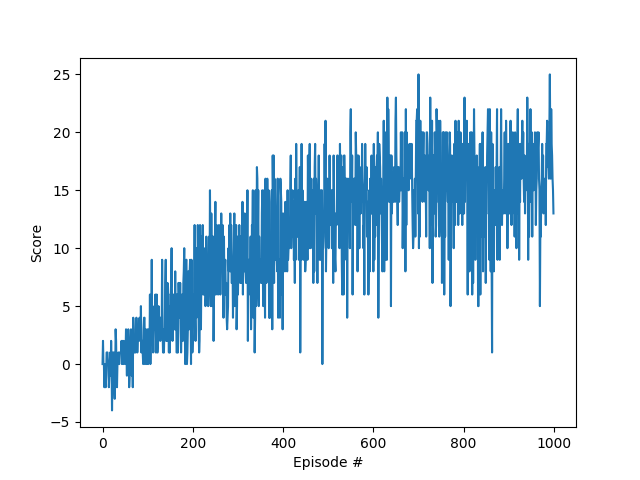

This details the methodology used in evaluating and improving agent learning performance.

## Introduction
This project uses a Deep Q Network (DQN) to train an agent to navigate a 3D environment, specifically a variant of the [Banana Collector](https://github.com/Unity-Technologies/ml-agents/blob/master/docs/Learning-Environment-Examples.md#banana-collector) environment.  This project is being done as part of the [Udacity Deep Reinforcement Learning Nanodegree](https://www.udacity.com/course/deep-reinforcement-learning-nanodegree--nd893).

## Algorithm
This agent implements the Deep Q Network (DQN) algorithm, within the 'agent.py' file.

DQN combines:

* Off-policy training - agent learns from the experience of another agent with a different (e.g. more exploratory) policy, and
* Bootstrapping - update estimates of the values of states based on estimates of the values of successor states, and
* Function approximation - through a neural network (specified in the next section), learns a function that maps states to actions even for unseen states.

This makes if very effective at learning even in high dimensional continuous state spaces.  However this combination, referred to as the "Deadly Triad" by Richard Sutton, is known to have divergence issues where the agent does not converge on a policy but instead oscillates all over the place.

To mitigate this, DQN also employs a couple modifications, including:

* Experience Replay - a finite memory buffer of past experiences that the agent can sample from during learning, and
* Fixed (or rather slowly changing) Q-targets - use a second neural network with weights that do not change as quickly as the online network and is used when calculating the TD target.

Both of these help stabilize converge but do not guarantee it.  More details are available in the original [DQN paper](https://deepmind.com/research/dqn/).

## Neural network model architecture
The neural network is implemented in the 'model.py' file, using the PyTorch framework.

The neural network model maps the state (input) to actions (output).  It consists of two fully connected hidden layers, each with 32 nodes and using relu activation.  Networks with two and three hidden layers were all tested and two was found to work best.  I tried 32 and 64 as the number of nodes in the hidden layers and 32 worked best.

## Parameters
The following parameters and settings were employed for the model ('model.py'):

* Number of hidden layers in neural network: 2
* Activation function: relu
* Number of nodes in hidden layers: 32

The following parameters and settings were employed for the agent ('agent.py'):

* Size of the replay buffer: 1e9
* Mini-batch size: 64
* Gamma discount factor: 0.99
* Tau (soft update of target network): 1e-3 (this means we adjust the weights slowly towards the target, although it is not completely fixed)
* Learning rate: 5e-4
* Number of experiences before a learning update is run: 4

The following parameters and settings were employed for the main training loop ('main.py'):

* Maximum number of episodes: 1000 (although one can interrupt execution after a score of 13 is achieved)
* Maximum number of steps per episode: 300 (this is the same as environment maximum, bit it could be reduced in experimentation)
* Epsilon (percentage exploration): eps = max(eps_end, eps_decay * eps_previous), where
    * eps starts at: 1.0
    * eps_end = 0.01 (this could potentially be reduced for better results)
    * eps_decay = 0.995

Many of these parameters could potentially be adjusted for improved performance.

## Results
The graph below shows the Score (average total reward over the previous 100 episodes maximum). This results file 'training_score_by_episode.png' is created after the Maximum number of episodes (1000) are completed.

Results will vary depending on the seed, but typically the agent is able to solve the environment in 400 - 550 episodes. The Score stabalises at a score of 16 eventually.

The saved 'checkpoint.pth' file contains the weights of a model that solved the environment in 450 episodes.

## Potential Improvements
There are plenty more things which could be tried to further improve performance, such as:

* Systematic hyperparameter optimisation, especially the neural network architecture combined with learning rate.
* Trying different loss functions, optimizers and learning rate.
* Double DQN or Duelling DQN
* Some of the more effective DQN modifications cited in the Rainbow DQN paper, like Prioritized Experience Replay and Multi-step Learning.